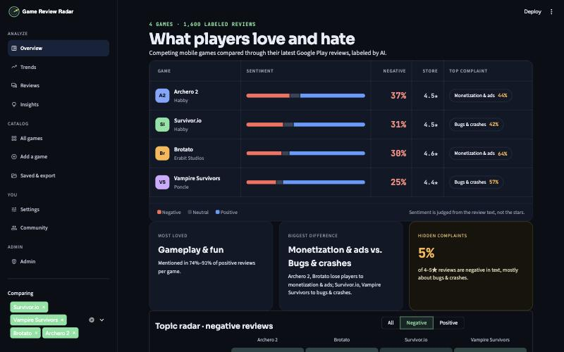
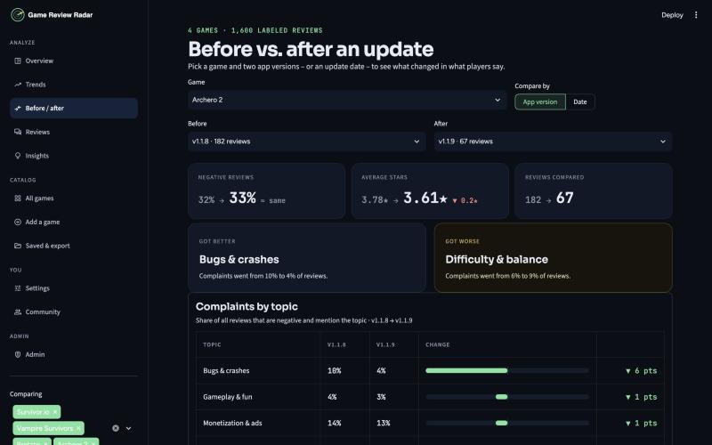
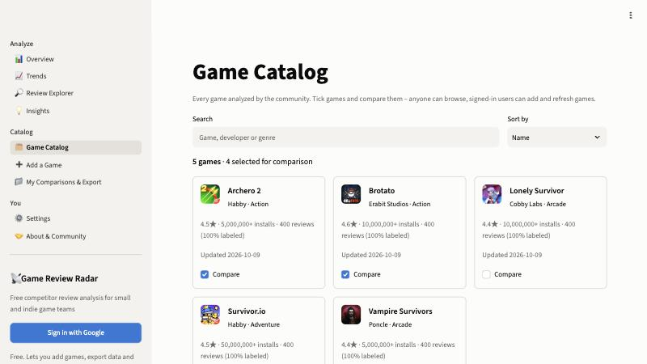
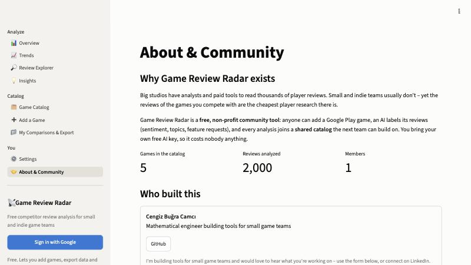
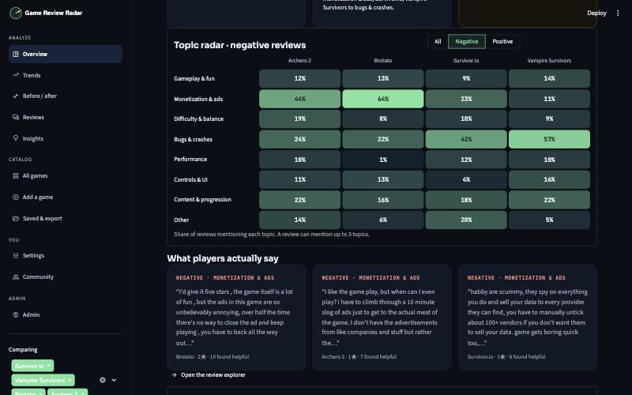
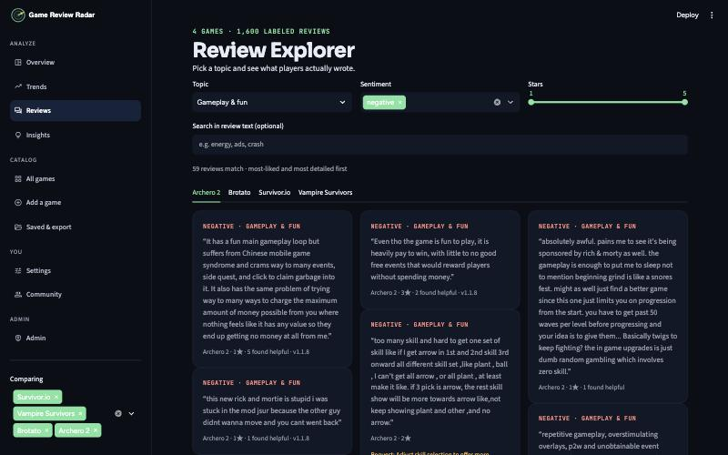
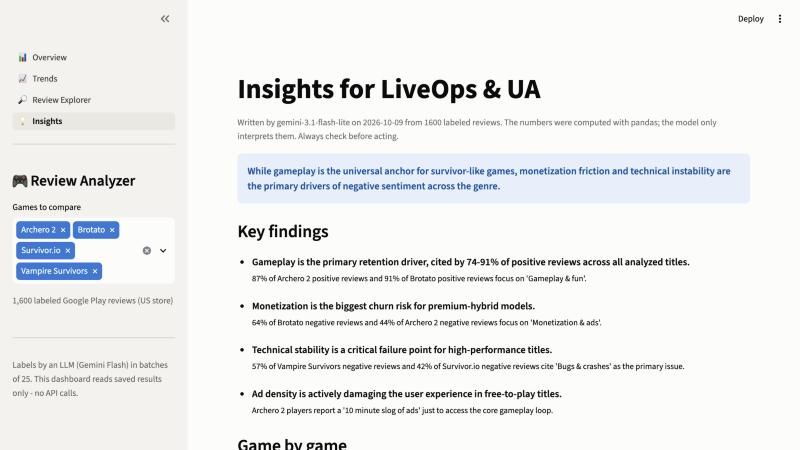
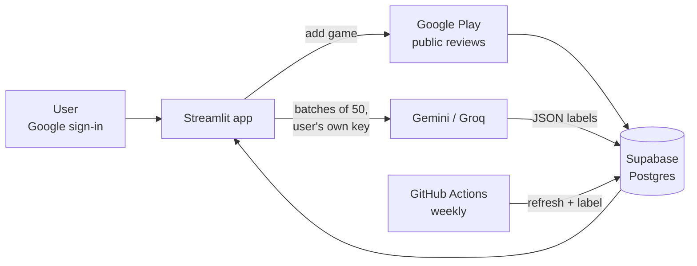

# 📡 Game Review Radar

**Free competitor review analysis for small and indie game teams.**

Big studios have analysts and paid tools to read thousands of player reviews. Small teams usually
don't, yet the reviews of the games you compete with are the cheapest player research there is.

Game Review Radar lets anyone add a Google Play game. An LLM labels every review (sentiment, topics,
feature requests), and the result joins a **shared, community-built catalog** that the next team can
compare against. Users bring their own free Gemini key, so it costs nobody anything. It's a non-profit
community project.

🔗 **Live app:** [game-review-radar.streamlit.app](https://game-review-radar.streamlit.app)



---

## What you can do

| | Feature |
|---|---|
| 📊 | **Compare up to 8 games**: sentiment, topic heatmaps (all / negative / positive reviews), stars vs. text |
| 📈 | **Trends** by week or month, and **sentiment by app version** to spot updates that upset players |
| 🔁 | **Before / after an update**: pick two app versions (or an update date) and see which complaints grew or shrank |
| 🎚️ | **Filters and per-game slices**: last 12 months by default (or any range), star range, and each game can have its own date range, app versions or latest version - e.g. one game's 2023 reviews next to another's latest update |
| ⬇️ | **Download what you need**: newest reviews, older ones, a date range or one app version - no per-game limit |
| 🔗 | **Shareable links**: the URL carries the games, filters and slices, so a comparison can be posted or sent as-is |
| 🔎 | **Review Explorer**: real quotes behind every number, with filters and text search |
| 💡 | **AI brief** for LiveOps, UA and game design, cached and shared per set of games |
| ➕ | **Add any Google Play game** by link or by search, in 8 store countries and languages |
| 🏷️ | **Custom topic lists**: label reviews through your own lens (e.g. energy system, gacha fairness) |
| 📁 | **Save comparisons** and **export** CSV, Excel (summary + reviews + feature requests) or JSON |
| 🔑 | **Bring your own key**: Gemini (free) or Groq, optionally saved **encrypted** on your account |
| 🤝 | **Community page**: opt-in member list, contributor credits on games, contact and game requests |
| 🛡️ | **Admin panel**: inbox, users and bans, catalog moderation, activity log, daily limits |
| 🔄 | **Weekly auto-refresh** of the whole catalog via GitHub Actions |

Browsing is open to everyone. Signing in with Google (free) unlocks adding games, labeling, exports
and saved comparisons.

| Before / after an update | Game Catalog | About & Community |
|---|---|---|
|  |  |  |

---

## Case study: four survivor-like games

The catalog started with 1,600 reviews of *Survivor.io*, *Vampire Survivors*, *Brotato* and *Archero 2*.

| Game | Negative reviews | #1 topic in negative reviews | Store rating |
|---|---|---|---|
| Vampire Survivors | **25%** | Bugs & crashes (57%) | 4.4★ |
| Brotato | **30%** | Monetization & ads (64%) | 4.6★ |
| Survivor.io | **31%** | Bugs & crashes (42%) | 4.5★ |
| Archero 2 | **37%** | Monetization & ads (44%) | 4.5★ |

1. **Gameplay is what players love everywhere:** 74–91% of positive reviews mention core gameplay & fun.
2. **Two different ways to lose players:** the F2P titles lose them to **monetization** (64% / 44% of
   complaints), the others to **stability** (57% / 42% bugs, crashes, lost progress).
3. **The store rating hides it:** all four sit at 4.4–4.6★, yet negative reviews range from 25% to 37%.
4. **Hidden complaints:** 3–9% of 4–5★ reviews have negative text. For Vampire Survivors, 25 of 28 are bug reports.
5. **329 feature requests** extracted, for example autosave during runs, cheaper ad removal and offline play.

| Topics in negative reviews | Review Explorer | AI brief |
|---|---|---|
|  |  |  |

---

## Architecture



```
core/      storage, Google Play collection, LLM labeling, insights, exports, encryption, limits
           (no Streamlit imports - the same code runs in the app, the CLI and GitHub Actions)
ui/        sign-in, cached data, shared components, long-running actions with progress
pages/     Overview · Trends · Review Explorer · Insights · Catalog · Add a Game ·
           Comparisons & Export · Settings · About & Community · Admin
scripts/   migration, secrets, weekly refresh, label agreement check, publishing
```

### Engineering decisions

| Decision | Why |
|---|---|
| **Bring-your-own-key** | The app is free to run; every user's labeling uses their own quota |
| **Keys encrypted at rest** (Fernet) | Only if the user ticks "remember". The database never holds a readable key, and the encryption key lives only in server secrets |
| **Google sign-in** (Streamlit `st.login`, OIDC) | No passwords stored, no password reset flow to build |
| **One SQL layer for SQLite and Postgres** | Same queries locally (SQLite file) and in production (Supabase); ~100 lines, no ORM |
| **Shared catalog, private workspaces** | Games and standard labels are shared, so the dataset grows with every user. Comparisons and custom topic lists stay private |
| **Batches of 50 reviews per call** | 800 reviews take 16 calls instead of 800, which fits free-tier daily limits |
| **Fixed standard topic list** | Free-form tags differ per game; a fixed list keeps games comparable. Custom lists are opt-in |
| **Error-specific LLM handling** | 429 → wait (server's `retryDelay`); no quota or 503 → fallback model; bad key → stop and tell the user |
| **Resumable labeling** | Saved after every batch; quota runs out → continue tomorrow, nothing lost |
| **Daily limits + activity log** | Protects the shared catalog and the scraper from abuse; admins can tune limits live |
| **Pandas for numbers, LLM for words** | The AI brief may only quote numbers computed by code, so it stays verifiable |
| **Copycat protection** | Google Play search is full of look-alike games; users confirm the developer before adding |

### Label quality

`scripts/agreement_check.py` re-labels a random sample with a second model and compares the results.
On 100 reviews: **88%** same sentiment, **91%** at least one shared topic. Labels are estimates,
good for comparing games, not ground truth for single reviews.

### Data source note

Apple's public App Store review RSS feed still answers but returns **zero reviews for every app**
(tested October 2026), so the app uses Google Play via the open-source
[`google-play-scraper`](https://github.com/JoMingyu/google-play-scraper). Only public reviews are
stored, without reviewer names.

---

## Tech stack

Python · pandas · Streamlit (multipage, `st.login`) · Plotly · Supabase Postgres (psycopg2) ·
SQLite · Google Gemini API · Groq API · cryptography (Fernet) · openpyxl · GitHub Actions ·
google-play-scraper

## Run it yourself

```bash
git clone https://github.com/bugracamci/game-review-analyzer.git
cd game-review-analyzer
bash scripts/setup_mac.sh            # venv + packages + .env (works on Linux too)
python scripts/migrate_v1.py         # load the sample data (1,600 reviews) into a local SQLite file
bash scripts/dev_run.sh              # open the app at http://localhost:8501
```

For the full setup (Supabase, Google sign-in, encrypted keys), fill in `.env` (see `.env.example`), then:

```bash
python scripts/make_secrets.py       # creates the encryption key + Streamlit secrets files
bash scripts/github_secrets.sh       # gives the weekly GitHub Action its database URL and key
```

Command-line tools (server key): `fetch_reviews.py`, `classify_reviews.py`, `generate_insights.py`,
`scripts/refresh_catalog.py`.

## Limitations and next steps

- Google Play only (Apple has no reliable free review source today); newest reviews, not full history.
- LLM labels are estimates; the AI brief should be checked against the quotes.
- Scraping public store pages sits in a grey area of store terms; daily limits keep usage small.
- **Next:** App Store support if a free source appears, email digests for watched games,
  and a public read-only API for the catalog.

---

Built by **Cengiz Buğra Camcı** for the indie game community. Say hello on the app's
**About & Community** page.
