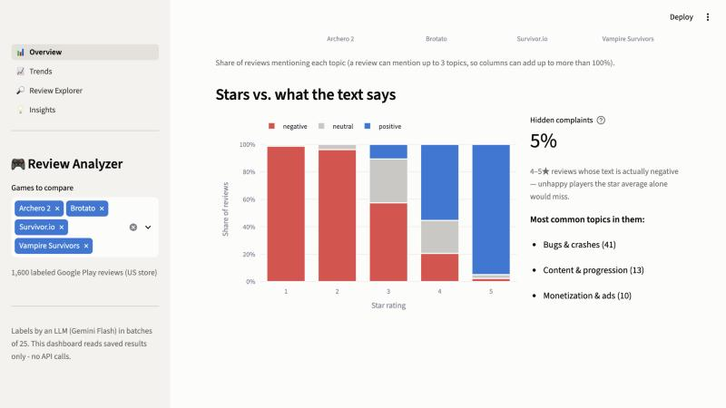
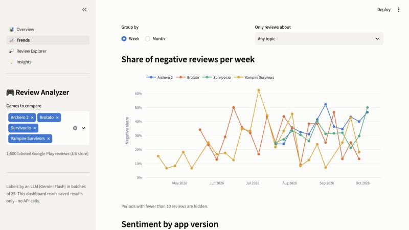
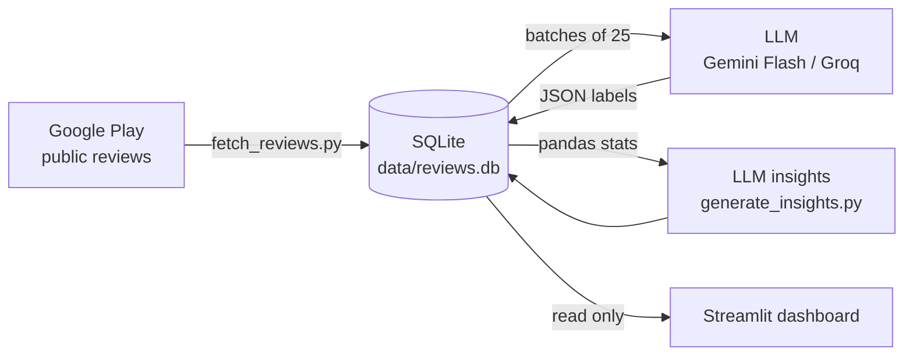

# 🎮 Mobile Game Review Analyzer

**What do players love, what do they complain about, and how do competing games differ?**

This tool pulls the latest Google Play reviews of competing mobile games, labels every review with an LLM
(sentiment, topics, feature requests) and shows the results in a Streamlit dashboard built for
LiveOps and user-acquisition (UA) teams.

The first analysis compares four **survivor-like / arena** games: *Survivor.io*, *Vampire Survivors*,
*Brotato* and *Archero 2*. That's **1,600 reviews**, labeled for **$0**.

🔗 **Live demo:** [game-review-analyzer.streamlit.app](https://game-review-analyzer.streamlit.app) (runs on saved data, no API calls)


---

## Key findings

| Game | Negative reviews | #1 topic in negative reviews | Store rating |
|---|---|---|---|
| Vampire Survivors | **25%** | Bugs & crashes (57%) | 4.4★ |
| Brotato | **30%** | Monetization & ads (64%) | 4.6★ |
| Survivor.io | **31%** | Bugs & crashes (42%) | 4.5★ |
| Archero 2 | **37%** | Monetization & ads (44%) | 4.5★ |

1. **Gameplay is what players love everywhere:** 74–91% of positive reviews mention core gameplay & fun.
   The genre's loop works; players leave for other reasons.
2. **Two different ways to lose players.** The free-to-play titles lose them to **monetization**: ads and
   pricing make up 64% of Brotato's and 44% of Archero 2's negative reviews. Vampire Survivors and Survivor.io
   lose them to **stability**: 57% and 42% of their complaints are bugs, crashes or lost progress.
3. **The store rating hides the difference.** All four games sit between 4.4★ and 4.6★, yet the share of
   negative reviews ranges from 25% to 37% in the recent sample.
4. **Hidden complaints:** 3–9% of 4–5★ reviews have negative text. Vampire Survivors has the most (9%), and
   25 of its 28 hidden complaints are bug reports from players who otherwise like the game.
5. **329 concrete feature requests** were extracted, for example autosave during runs, a cheaper ad-removal option,
   offline play and a way to skip daily chores.

The full LLM-written brief (LiveOps actions, UA ad angles, opportunities for a new game) is on the
**Insights** page of the dashboard.

| What players talk about (negative reviews) | Stars vs. what the text says |
|---|---|
|  |  |

| Trends over time | Review Explorer | Insights |
|---|---|---|
|  |  |  |

---

## How it works



1. **Fetch** (`fetch_reviews.py`): newest 400 reviews per game from Google Play (US store). Games are
   listed in `games.json`, and each one is checked against its **expected developer**, so copycat apps with
   similar names are rejected.
2. **Classify** (`classify_reviews.py`): reviews go to the LLM in **batches of 25** and come back as
   structured JSON: sentiment (judged from the text, not the stars), 1–3 topics from a fixed list, and an
   optional feature-request summary. Results are saved after every batch, so a stopped run resumes where it
   left off.
3. **Insights** (`generate_insights.py`): pandas computes the numbers; the LLM only interprets them and
   is instructed to quote only the numbers it is given.
4. **Dashboard** (`app.py` + `pages/`): reads the saved database only. **No API calls**, so the live demo
   is free and fast.

### Engineering decisions

| Decision | Why |
|---|---|
| Batches of 25 reviews per call | 1,600 reviews take 64 calls instead of 1,600, which fits free-tier limits |
| Fixed topic list | Free-form tags differ per game; a fixed list makes games comparable |
| Error-specific retry logic | 429 → wait (uses the server's `retryDelay`); 503 or no free quota → switch to a fallback model; 400/401 → stop, because retrying won't help |
| Provider switch in one setting | `LLM_PROVIDER=gemini` or `groq` in `.env`; plain HTTP calls, no vendor SDKs |
| Model recorded per label | The free tier allows ~20 requests/day per model, so labeling used three Gemini models. Each label stores its model for traceability |
| Pandas for numbers, LLM for words | Keeps the insight brief verifiable and avoids made-up statistics |

### Label quality check

Because the free tier forced model switches mid-run, `scripts/agreement_check.py` re-labeled a random
sample of 100 reviews with a second model and compared the results:

| Metric | Agreement |
|---|---|
| Same sentiment | **88%** |
| At least one shared topic | **91%** |

That's high enough for the comparisons in this report. Single-review labels should still be read as
estimates, not ground truth.

### Data source note

The original plan was Apple's public App Store review RSS feed. Tested in October 2026, it still answers but
returns **zero reviews for every app**. The App Store web page embeds only ~8 reviews, and the rest sits behind
a private, token-protected API. The project therefore uses Google Play via the open-source
[`google-play-scraper`](https://github.com/JoMingyu/google-play-scraper) package.

---

## Tech stack

Python · pandas · SQLite · Google Gemini API (free tier) · Groq API (optional fallback) ·
Streamlit · Plotly · google-play-scraper

## Run it yourself

```bash
git clone https://github.com/<your-username>/game-review-analyzer.git
cd game-review-analyzer
python3 -m venv .venv && source .venv/bin/activate
pip install -r requirements.txt

# Dashboard only (uses the included sample data, no key needed)
streamlit run app.py
```

To collect and label fresh data, get a free key at [Google AI Studio](https://aistudio.google.com), then:

```bash
cp .env.example .env              # paste your key into GEMINI_API_KEY
python fetch_reviews.py           # download reviews
python classify_reviews.py        # label them (resumable)
python generate_insights.py       # write the insight brief
```

**Add or remove a game:** edit `games.json` (name, developer, Google Play package id), then run
`fetch_reviews.py` and `classify_reviews.py`. Removed games are deleted from the database automatically.

## Project structure

```
├── app.py                 # Streamlit entry point + sidebar game selector
├── pages/                 # Overview, Trends, Review Explorer, Insights
├── dashboard_data.py      # cached data loading, colors, chart style
├── fetch_reviews.py       # step 1: Google Play -> SQLite
├── classify_reviews.py    # step 2: LLM labels in batches
├── generate_insights.py   # step 3: LLM brief from pandas stats
├── llm_client.py          # Gemini / Groq client with retries and fallbacks
├── config.py              # topics, models, batch size
├── db.py                  # SQLite schema
├── games.json             # which games to compare
├── scripts/               # setup, pipeline runner, label agreement check
└── data/reviews.db        # sample data used by the live demo
```

## Limitations and next steps

- One store (Google Play, US) and the latest 400 reviews per game: a recent snapshot, not the full history.
- LLM labels are estimates (88% sentiment agreement between two models).
- **Next:** an "add a game" form in the dashboard (local use only, to protect API quota), App Store
  data once a reliable free source exists, and multi-country comparison.
